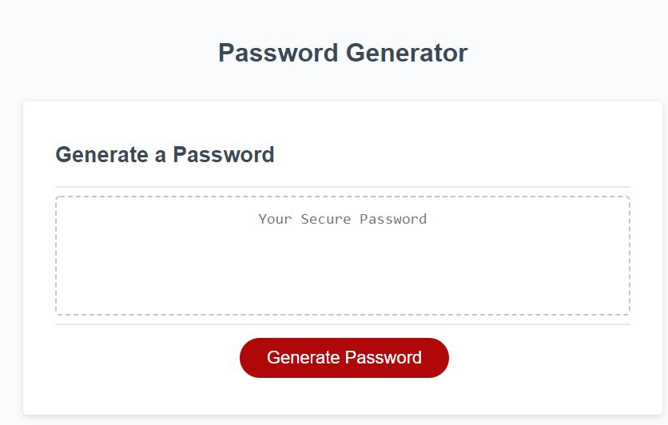
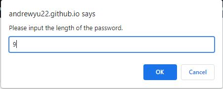
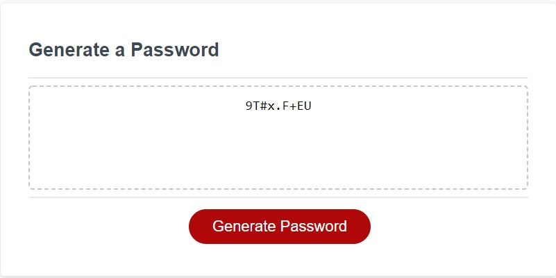
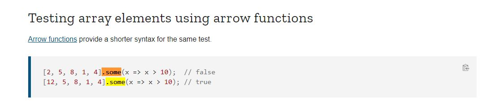

# Password-Generator

## Description
Generate a random password using Javascript.

Requirements:
1) Prompt Users to enter password length, must be between 8 to 128 characters.
2) Prompt Users for password criteria: lowercase, uppercase, numeric, and/or special characters.
3) Generate Password that validates and matches the criteria.

## Table of Contents 
* [Links](#Links)
* [Usage](#Usage)
* [Credits](#Credits)

## Links

Repo: https://github.com/andrewyu22/Password-Generator

Link: https://andrewyu22.github.io/Password-Generator/

## Usage

## Credits

https://developer.mozilla.org/en-US/docs/Web/JavaScript/Reference/Global_Objects/Array/some

